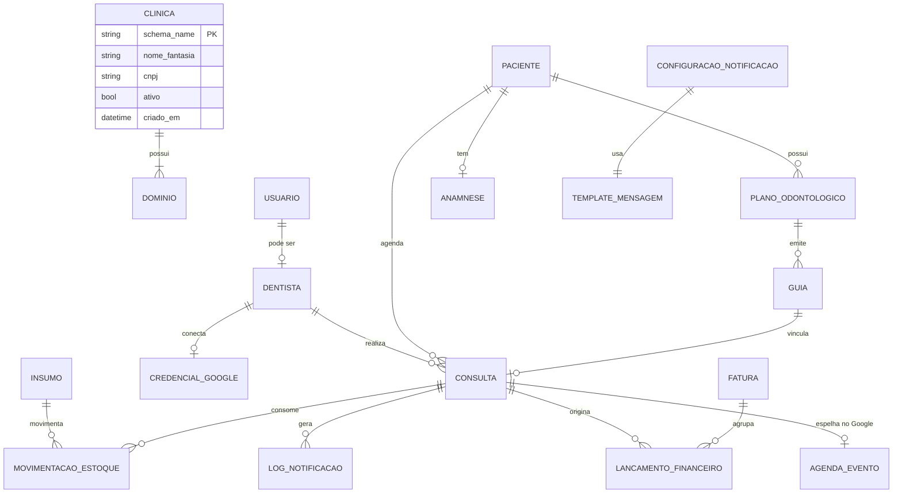

# OdontoSaaS — Modelagem de Dados

> Blueprint das *models* do Django, com nomes semânticos, campos principais, status e relacionamentos,
> organizados por **schema** (public/tenant). A implementação ocorre tarefa a tarefa pelo
> [Backlog](03-BACKLOG-SPRINTS.md) — este documento é a referência de destino.

---

## 1. Organização por Schema

| Schema | Apps | Responsabilidade |
|---|---|---|
| **public** (SHARED) | `tenants`, `plataforma` | Clínicas (tenants), domínios, assinatura do SaaS |
| **tenant** (por clínica) | `usuarios`, `dentistas`, `pacientes`, `agenda`, `notificacoes`, `integracoes`, `estoque`, `financeiro` | Dados isolados de cada clínica |

---

## 2. Diagrama de Entidade-Relacionamento (visão macro)

---

## 3. Schema `public` — App `tenants`

### `Clinica` (tenant)
| Campo | Tipo | Notas |
|---|---|---|
| `schema_name` | slug | PK lógica do tenant (django-tenants) |
| `nome_fantasia` | char | Nome da clínica |
| `razao_social` | char | |
| `cnpj` | char(14) | único |
| `telefone` | char | |
| `plano_assinatura` | FK → `PlanoAssinatura` | plano do SaaS |
| `ativo` | bool | soft-disable do tenant |
| `criado_em` | datetime | |

### `Dominio`
| Campo | Tipo | Notas |
|---|---|---|
| `dominio` | char | ex.: `clinicasorriso.odonto.app` |
| `clinica` | FK → `Clinica` | |
| `is_primary` | bool | |

### `PlanoAssinatura` (app `plataforma`)
Planos comerciais do SaaS (limites, preço). Não confundir com `PlanoOdontologico` do paciente.

---

## 4. Schema `tenant` — App `usuarios`

### `Usuario` (AbstractUser custom)
| Campo | Tipo | Notas |
|---|---|---|
| `email` | email | login (username-less) |
| `nome_completo` | char | |
| `papel` | enum | `ADMIN`, `DENTISTA`, `RECEPCAO`, `FINANCEIRO` |
| `ativo` | bool | |

---

## 5. App `dentistas`

### `Dentista`
| Campo | Tipo | Notas |
|---|---|---|
| `usuario` | O2O → `Usuario` | login opcional do profissional |
| `nome_completo` | char | |
| `cro` | char | registro no Conselho (único) |
| `especialidades` | M2M → `Especialidade` | |
| `telefone` / `email` | char | |
| `ativo` | bool | |

### `Especialidade`
`nome` (ex.: Ortodontia, Endodontia, Implantodontia).

---

## 6. App `pacientes`

### `Paciente`
| Campo | Tipo | Notas |
|---|---|---|
| `nome_completo` | char | |
| `cpf` | char(11) | único no tenant |
| `data_nascimento` | date | |
| `telefone_whatsapp` | char | usado nas notificações |
| `email` | email | |
| `endereco` | (campos) | |
| `ativo` | bool | |
| `criado_em` | datetime | |

### `PlanoOdontologico`  *(vários por paciente)*
| Campo | Tipo | Notas |
|---|---|---|
| `paciente` | FK → `Paciente` | |
| `operadora` | char | ex.: Amil Dental, Uniodonto |
| `numero_carteirinha` | char | |
| `validade` | date | |
| `status` | enum | `ATIVO`, `SUSPENSO`, `CANCELADO` |

### `Guia`  *(vincula plano ↔ consulta)*
| Campo | Tipo | Notas |
|---|---|---|
| `plano` | FK → `PlanoOdontologico` | |
| `consulta` | FK → `Consulta` (null) | vinculada quando o atendimento ocorre |
| `numero_guia` | char | |
| `procedimento` | char | descrição/código TUSS |
| `valor` | decimal | |
| `status` | enum | `EMITIDA`, `AUTORIZADA`, `EXECUTADA`, `GLOSADA`, `PAGA` |

---

## 7. App `agenda` (Atendimento, Clínica e Google)

### `Consulta`
| Campo | Tipo | Notas |
|---|---|---|
| `paciente` | FK → `Paciente` | |
| `dentista` | FK → `Dentista` | |
| `guia` | FK → `Guia` (null) | particular ou por plano |
| `inicio` / `fim` | datetime | |
| `procedimento` | char | |
| `status` | enum | `AGENDADA`, `EM_ATENDIMENTO`, `REALIZADA`, `CANCELADA`, `FALTOU` |
| `status_confirmacao` | enum | `PENDENTE`, `CONFIRMADA`, `RECUSADA`, `SEM_RESPOSTA` |
| `confirmado_em` | datetime (null) | preenchido pela resposta WhatsApp |
| `google_event_id` | char (null) | ID do evento no Google Calendar |
| `observacoes` | text | |

### `Anamnese`
| Campo | Tipo | Notas |
|---|---|---|
| `paciente` | FK → `Paciente` | |
| `consulta` | FK → `Consulta` (null) | anamnese pode ser inicial ou por consulta |
| `queixa_principal` | text | |
| `historico_medico` | json/text | doenças, alergias, medicações |
| `pressao_arterial` | char | |
| `fumante` / `diabetico` / `gestante` | bool | flags de risco |
| `registrado_por` | FK → `Dentista` | |
| `criado_em` | datetime | |

### `AgendaEvento` (espelho local do evento Google)
| Campo | Tipo | Notas |
|---|---|---|
| `consulta` | O2O → `Consulta` | |
| `google_event_id` | char | |
| `calendar_id` | char | agenda da clínica ou do dentista |
| `etag` / `sync_token` | char | controle de sincronização |
| `ultima_sincronizacao` | datetime | |
| `status_sync` | enum | `PENDENTE`, `SINCRONIZADO`, `ERRO` |

---

## 8. App `integracoes`

### `CredencialGoogleCalendar`
| Campo | Tipo | Notas |
|---|---|---|
| `dentista` | FK → `Dentista` (null) | null = credencial da clínica |
| `calendar_id` | char | `primary` ou ID específico |
| `access_token` | text (**criptografado**) | |
| `refresh_token` | text (**criptografado**) | |
| `token_expiry` | datetime | |
| `scope` | char | |
| `watch_channel_id` / `watch_resource_id` | char (null) | push notifications |
| `watch_expiration` | datetime (null) | renovação do canal |
| `ativo` | bool | |

---

## 9. App `notificacoes` (WhatsApp / WAHA)

### `ConfiguracaoNotificacao`  *(1 por clínica)*
| Campo | Tipo | Notas |
|---|---|---|
| `dias_antecedencia` | int | quando disparar (ex.: 1 = véspera) |
| `horario_envio` | time | janela preferencial |
| `waha_session` | char | nome da session da clínica no WAHA (ex.: `clinica-<schema>`) |
| `ativo` | bool | liga/desliga automação |

### `TemplateMensagem`
| Campo | Tipo | Notas |
|---|---|---|
| `tipo` | enum | `CONFIRMACAO`, `LEMBRETE`, `CANCELAMENTO` |
| `corpo` | text | variáveis `{{paciente}}`, `{{data}}`, `{{hora}}`, `{{dentista}}` |
| `ativo` | bool | |

### `LogNotificacao`
| Campo | Tipo | Notas |
|---|---|---|
| `consulta` | FK → `Consulta` | |
| `template` | FK → `TemplateMensagem` | |
| `canal` | enum | `WHATSAPP` |
| `direcao` | enum | `ENVIADA`, `RECEBIDA` |
| `mensagem` | text | conteúdo enviado/recebido |
| `status` | enum | `ENFILEIRADA`, `ENVIADA`, `ENTREGUE`, `LIDA`, `RESPONDIDA`, `ERRO` |
| `resposta_paciente` | char (null) | texto bruto da resposta |
| `enviado_em` / `respondido_em` | datetime | |
| `payload_provedor` | json | resposta/erro do WAHA |

---

## 10. App `estoque` (Insumos)

### `Insumo`
| Campo | Tipo | Notas |
|---|---|---|
| `nome` | char | |
| `categoria` | FK → `CategoriaInsumo` | |
| `unidade_medida` | enum | `UN`, `CX`, `ML`, `G` |
| `quantidade_atual` | decimal | saldo derivado das movimentações |
| `estoque_minimo` | decimal | alerta de reposição |
| `custo_unitario` | decimal | |
| `ativo` | bool | |

### `MovimentacaoEstoque`
| Campo | Tipo | Notas |
|---|---|---|
| `insumo` | FK → `Insumo` | |
| `tipo` | enum | `ENTRADA`, `SAIDA`, `AJUSTE` |
| `quantidade` | decimal | |
| `consulta` | FK → `Consulta` (null) | consumo vinculado ao atendimento |
| `motivo` | char | |
| `criado_em` | datetime | |

---

## 11. App `financeiro`

### `LancamentoFinanceiro`
| Campo | Tipo | Notas |
|---|---|---|
| `tipo` | enum | `RECEBER`, `PAGAR` |
| `origem` | enum | `CONSULTA`, `GUIA`, `MANUAL`, `INSUMO` |
| `consulta` | FK → `Consulta` (null) | geração automática |
| `guia` | FK → `Guia` (null) | faturamento por plano |
| `descricao` | char | |
| `valor` | decimal | |
| `vencimento` | date | |
| `status` | enum | `PENDENTE`, `PAGO`, `RECEBIDO`, `ATRASADO`, `CANCELADO` |
| `pago_em` | date (null) | |
| `criado_por` | FK → `Usuario` (null) | null = automático |

### `Fatura`
| Campo | Tipo | Notas |
|---|---|---|
| `operadora` | char | plano faturado |
| `competencia` | date | mês de referência |
| `valor_total` | decimal | soma das guias |
| `status` | enum | `ABERTA`, `ENVIADA`, `PAGA`, `GLOSADA_PARCIAL` |
| `lancamentos` | reverse FK | guias/lançamentos agrupados |

---

## 12. Convenções Transversais

- **Base abstrata `ModeloBase`**: `criado_em`, `atualizado_em`, `ativo` (soft delete quando aplicável).
- **Choices como `TextChoices`** (enums nomeados) para todos os campos `status`/`tipo`.
- **Isolamento**: nenhum modelo de tenant referencia diretamente outro tenant — o schema garante o
  isolamento; não há `tenant_id` explícito nos apps de tenant.
- **Índices** em `cpf`, `cnpj`, `google_event_id`, `Consulta.inicio`, `LogNotificacao.status`.

---

Ver também: [Arquitetura](01-ARQUITETURA.md) · [Backlog de Sprints](03-BACKLOG-SPRINTS.md)
