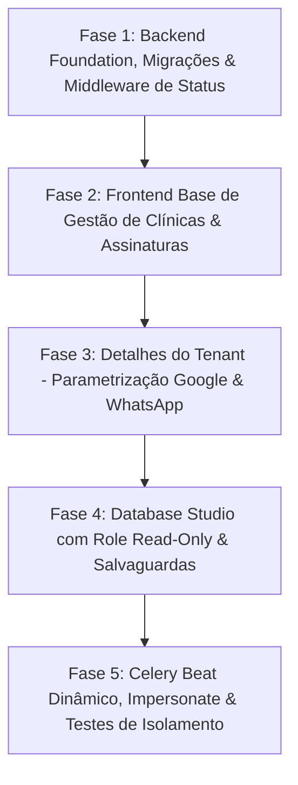

# 08 — Painel de Admin da Plataforma (Vendor Admin)

> **Documento Oficial de Arquitetura, Requisitos e Segurança.**
> Define a arquitetura, segurança, modelo de dados, contratos de API, salvaguardas e interfaces do **Painel de Admin da Plataforma (Vendor Admin)** do PróClínica (OdontoSaaS).
> Este painel é de uso **exclusivo dos mantenedores/operadores do SaaS** (não é acessível pelas clínicas clientes) e opera diretamente sobre o schema `public` e orquestra os schemas dos tenants.

---

## 1. 📌 Visão Geral & Objetivos

O **Painel de Admin da Plataforma** centraliza a governança comercial, técnica e operacional do SaaS. Ele elimina a necessidade de intervenções manuais via terminal/SSH para tarefas rotineiras de suporte, provisionamento, parametrização e auditoria.

### Pilares de Negócio & Operação:
1. **Gestão Comercial & Planos:** Criação, precificação, definição de limites, controle de assinaturas e gatilho de faturamento.
2. **Gestão do Ciclo de Vida de Tenants (Clínicas):** Provisionamento instantâneo, bloqueio/desbloqueio por inadimplência, exclusão com salvaguarda e auditoria.
3. **Parametrização & Overrides por Clínica:** Ajuste de variáveis de tempo e regras de integração (intervalo de sync com Google, automações de WhatsApp, dias/horas de antecedência, overrides de limites).
4. **Database Studio Interativo:** Console embutido para inspeção e manipulação controlada de tabelas e schemas do PostgreSQL com travas de segurança, role de menor privilégio e auditoria estrita.
5. **Observabilidade & Filas:** Monitoramento de saúde, tarefas periódicas do Celery Beat e logs operacionais.

---

## 2. 🏗️ Arquitetura, Roteamento & Segurança

### 2.1. Roteamento e Isolamento Multi-Tenant

O Painel de Admin do Vendor opera sob o **schema `public`** da aplicação.

```
                    ┌────────────────────────────────────────────────────────┐
                    │               Roteamento de Domínio                     │
                    └───────────────────────────┬────────────────────────────┘
                                                │
                 ┌──────────────────────────────┴──────────────────────────────┐
                 ▼                                                             ▼
    *.proclinica.cloud (ou *.localhost)                          <subdominio_secreto>.proclinica.cloud/<path_secreto>/
    TenantMainMiddleware resolve Tenant                          Resolve para Schema PUBLIC
    Schema: <schema_da_clinica>                                  Schema: public
    Auth: Usuario do Tenant                                      Auth: SuperAdmin / VendorOperator
```

* **Subdomínio & Rota Dinâmicos (Zero Hardcode):**
  * Definidos exclusivamente no `.env` do servidor:
    * `VENDOR_ADMIN_SUBDOMAIN` (ex.: `ops-9k2x` → `ops-9k2x.proclinica.cloud`)
    * `VENDOR_ADMIN_SECRET_PATH` (ex.: `portal-core-7781`)
  * URL de acesso: `https://ops-9k2x.proclinica.cloud/portal-core-7781/`
* **Camuflagem de Host (Defesa em Profundidade):**
  * Qualquer acesso à raiz (`/`) ou rotas padrão (`/admin`, `/login`, `/dashboard`) no host administrativo responde com um **`404 Not Found` estático e genérico**, parecendo um host inativo ou inexistente.
* **Isolamento de Credenciais:** O login do Vendor Admin valida exclusivamente operadores cadastrados no schema `public` com `is_superuser=True` ou permissões de Vendor, completamente segregados dos usuários dos schemas de clínicas.

### 2.2. Tripé Primário de Segurança & Controles de Acesso

A segurança do backoffice **não depende de obscuridade**. A proteção real é garantida por:

1. **Autenticação Forte com 2FA / MFA Obrigatório:**
   * TOTP via aplicativo autenticador (Google Authenticator, 1Password, etc.) obrigatório para qualquer operador.
2. **Vendor RBAC (Papéis Administrativos Segregados):**
   * `SUPERADMIN`: Acesso irrestrito (planos, financeiro global, exclusão física de tenants, Database Studio em modo de escrita/DML).
   * `SUPORTE_L2`: Gestão de clínicas, visualização de logs, parametrizações de tempo, Database Studio em modo **Read-Only**.
   * `COMERCIAL`: Visualização de clínicas, planos e métricas agregadas (sem acesso a dados clínicos de pacientes nem Database Studio).
3. **IP Allowlist / Acesso por VPN (Tailscale/WireGuard):**
   * O proxy reverso (Caddy) e o Django restringem o acesso ao subdomínio do vendor a uma lista de IPs permitidos ou à rede interna da VPN.
4. **Proteção contra Força Bruta (Lockout no Redis):**
   * Reutiliza a lógica de lockout no cache Redis: 5 tentativas incorretas por IP bloqueiam o acesso por 15 minutos, retornando HTTP `429 Too Many Requests`.

### 2.3. Pré-requisito de Infraestrutura para TLS Wildcard
* O Caddy atual em produção opera com validação HTTP-01 por host explícito (`SITE_ADDRESS`).
* Para que o subdomínio administrativo não vaze em registros públicos de *Certificate Transparency* (CT Logs), é pré-requisito configurar **DNS Wildcard (`*.proclinica.cloud`)** com desafio **DNS-01** no Caddy (via plugin do provedor de DNS + API Token).

---

## 3. 📦 Módulo 1: Gestão de Planos & Assinaturas

Gerencia o catálogo comercial do SaaS através do model `plataforma.PlanoAssinatura` (schema `public`).

### 3.1. Campos Existentes vs Migrações Necessárias

| Campo | Status no Código Atual | Descrição |
|---|---|---|
| `nome` | ✅ Já existe no model | Nome comercial do plano (ex.: *Básico*, *Profissional*, *Enterprise*) |
| `preco_mensal` | ✅ Já existe no model | Valor mensal da assinatura em BRL |
| `limite_dentistas` | ✅ Já existe no model | Quantidade máxima de dentistas permitida (null = ilimitado) |
| `limite_usuarios` | ✅ Já existe no model | Quantidade máxima de usuários de equipe/recepção (null = ilimitado) |
| `ativo` | ✅ Já existe no model | Flag de ativação no catálogo comercial |
| `preco_anual` | ⏳ Requer migração | Valor com desconto para faturamento anual |
| `limite_pacientes_ativos` | ⏳ Requer migração | Limite de cadastros de pacientes (opcional) |
| `limite_armazenamento_mb` | ⏳ Requer migração | Cota de disco para anexos futuros (raio-X, fotos) |
| `modulo_financeiro_ativo` | ⏳ Requer migração | Flag para habilitar/desabilitar módulo financeiro |
| `modulo_estoque_ativo` | ⏳ Requer migração | Flag para habilitar/desabilitar módulo de estoque |
| `sync_google_ativo` | ⏳ Requer migração | Flag para permitir sincronização com Google Calendar |
| `whatsapp_waha_ativo` | ⏳ Requer migração | Flag para permitir automações de WhatsApp |

### 3.2. Integração com Billing & Inadimplência Automática (Conexão com `docs/05`)
Para suportar cobrança recorrente via gateway (Asaas/Stripe/Pagar.me), o model `tenants.Clinica` no schema `public` receberá (via migração):
* `status_assinatura` (`TRIAL`, `ATIVA`, `INADIMPLENTE`, `CANCELADA`).
* `gateway_customer_id` e `gateway_subscription_id`.
* `vigencia_fim` (data limite da fatura paga).
* **Webhook do Gateway Seguro:** Webhook em `POST /api/plataforma/webhook-pagamento/` **com validação obrigatória de assinatura criptográfica (HMAC)** via secret configurado em ambiente. Atualiza o `status_assinatura` e suspende/reativa a clínica automaticamente se a cobrança falhar após o período de carência, impedindo requisições forjadas.

---

## 4. 🏢 Módulo 2: Gestão de Tenants (Clínicas)

Gerencia o ciclo de vida dos schemas e domínios através de `tenants.Clinica` e `tenants.Dominio`.

### 4.1. Funcionalidades Principais
* **Listagem Inteligente de Tenants:**
  * Tabela com busca por Razão Social, Nome Fantasia, CNPJ, Subdomínio e Schema.
  * Badges de status: `ATIVO`, `SUSPENSO / BLOQUEADO`, `TRIAL`, `CANCELADO`.
  * Filtros por Plano, Data de Criação e Status de Conexão.
* **Wizard de Provisionamento:**
  * Interface visual que invoca o serviço de provisionamento equivalente ao comando `provisionar_clinica`:
    1. Criação da `Clinica` (dispara `auto_create_schema=True` criando o schema PostgreSQL).
    2. Criação do `Dominio` primário.
    3. Execução das migrações do tenant.
    4. Sementeira de dados essenciais (`sincronizar_grupos`, `semear_especialidades_padrao`, `semear_templates_padrao`).
    5. Criação do primeiro usuário `ADMIN` da clínica.
    6. Associação ao `PlanoAssinatura` selecionado.
* **Bloqueio e Desbloqueio Instantâneo:**
  * Alternar campo `Clinica.ativo = False`.
  * **Middleware Obrigatório (a implementar):** Como o `TenantMainMiddleware` padrão do `django-tenants` não barra tenants inativos, implementaremos o `TenantStatusMiddleware` (posicionado logo após a resolução de tenant) que intercepta `if not request.tenant.ativo` e retorna `403 Forbidden` com tela amigável de suspensão.
* **Exclusão & Expurgo (Ação Crítica com Salvaguardas):**
  * **Soft-Delete (Padrão):** Desativa a clínica (`ativo=False`) e remove o domínio.
  * **Hard Expurgo (Destruição Física de Schema):**
    * Exige confirmação digitando o nome exato do schema.
    * Gera automaticamente um backup (`pg_dump` do schema) antes da exclusão física.
    * Executa o drop do schema PostgreSQL e remove os registros de `public`.

---

## 5. 🔍 Módulo 3: Detalhes & Parametrizações Específicas por Tenant

Ao selecionar uma clínica específica, o operador tem acesso ao painel aprofundado com 5 abas de controle:

### 5.1. Aba 1: Dados Gerais & Acesso do Administrador
* Edição de Nome Fantasia, Razão Social, CNPJ, Telefone de Contato.
* **Gestão do Admin da Clínica:**
  * Visualização do e-mail do admin principal do tenant.
  * Redefinição Forçada de Senha (gera senha temporária segura).
  * **Impersonate Seguro / Login como Clínica:**
    * Gera token JWT de sessão de suporte com expiração curta (1 hora).
    * **Modos de Acesso:**
      * *Modo Somente Leitura (Padrão para L1/L2):* Bloqueia mutações (POST/PUT/PATCH/DELETE) na API da clínica e apenas permite visualizar dados/telas, minimizando a superfície de risco.
      * *Modo Escrita/Completo (SuperAdmin):* Permite intervenção assistida direta na conta.
    * Abre a SPA da clínica com banner superior persistente: *"Você está navegando como Suporte da Plataforma (Modo Somente Leitura / Completo)"*.
    * Todas as ações durante o impersonate são carimbadas no log de auditoria com o ID do operador.

### 5.2. Aba 2: Assinatura & Overrides de Limites
* Troca manual de plano de assinatura.
* **Persistência de Overrides de Limite:**
  * Armazenados em campos dedicados no model `tenants.Clinica`:
    * `override_limite_dentistas` (inteiro, default `None`).
    * `override_limite_usuarios` (inteiro, default `None`).
    * `override_recursos` (`JSONField` opcional para ativar módulos fora do plano padrão).
  * O método `clinica.get_limite_dentistas()` aplica: `override if override is not None else plano.limite_dentistas`.

### 5.3. Aba 3: Motor de Integração Google Calendar
> *Conforme definido em `docs/04-OBSERVACOES-PAINEL-ADMIN.md`, o intervalo de sincronização é **Vendor Only**.*

* **Intervalo de Reconciliação (`intervalo_minutos`):**
  * Campo numérico ajustável (ex.: 5, 10, 15, 30 min).
  * Salva em `integracoes.ConfiguracaoSincronizacao.intervalo_minutos` no schema do tenant.
* **Status das Credenciais:**
  * Lista de contas conectadas (clínica e dentistas).
  * Status dos tokens e botão para **Forçar Reconciliação Imediata** (`reconciliar_google_tenant.delay(schema)`).
  * Botão de **Revogação / Desconexão Forçada**.

### 5.4. Aba 4: Motor de WhatsApp (WAHA) & Mensageria
* **Status da Sessão WAHA:**
  * Nome da sessão: **é o próprio nome do schema** (ex.: `mercadante`, resolvido no serializer/viewset `_garantir_config` em `apps/notificacoes/{serializers,views}.py`).
  * Estados reais do WAHA: `WORKING` (conectado), `SCAN_QR_CODE`, `STARTING`, `STOPPED`, `FAILED`.
  * Ações: Reiniciar Sessão, Desconectar Sessão, Visualizar QR Code em tempo real (para suporte assistido).
* **Parâmetros de Disparo e Tempo (por clínica):**
  * `dias_antecedencia` (ex.: 1 dia antes).
  * `horario_envio` (ex.: 08:00).
  * `cancelar_nao_confirmadas` + `cancelar_horas_antes` (auto-cancelamento de no-show).
  * `reforcar_confirmacao` + `mensagem_reforco`.
  * `enviar_agradecimento` (bool).
* **Frequência dos Lembretes e Recalls:**
  * Ajuste dos intervalos de recall por procedimento e avisos pré-consulta.

### 5.5. Aba 5: Métricas Operacionais & Logs de Erro
* Total de pacientes cadastrados vs limite.
* Total de dentistas ativos vs limite.
* Consultas realizadas no mês atual.
* Quantidade de mensagens WhatsApp enviadas no mês (controle de custos/consumo).
* **Logs de Erro por Clínica:**
  * Como hoje os erros são emitidos para `stdout` JSON / Sentry (sem tabela de banco por schema), a exibição dos erros recentes no painel dependerá de:
    * Criação do model `RegistroErroOperacional` (schema `public`, com `schema_tenant`, `timestamp`, `endpoint`, `traceback`) **OU**
    * Consulta à API do Sentry via `SENTRY_API_TOKEN`.

---

## 6. 🗄️ Módulo 4: Database Studio Interativo (Console de Dados)

Permite que engenheiros e suporte técnico realizem consultas, correções e inspeções no PostgreSQL de forma produtiva e segura através da interface web.

```
┌──────────────────────────────────────────────────────────────────────────────────────────┐
│ Database Studio                                                  [Schema: mercadante ▾] │
├──────────────────────────┬───────────────────────────────────────────────────────────────┤
│ Tabelas                  │ Console SQL / Visualizador                                    │
│ ──────────────────────── │ ───────────────────────────────────────────────────────────── │
│ 📁 public                │ [ Role: READ-ONLY (Safe) ▾ ] [ Limite: 100 linhas ] [ ▶ Exec] │
│   ├─ tenants_clinica     │                                                               │
│   └─ plataforma_plano... │ SELECT id, inicio, fim, status, status_confirmacao            │
│ 📁 tenant (mercadante)   │ FROM agenda_consulta                                          │
│   ├─ agenda_consulta (42)│ WHERE status = 'AGENDADA'                                     │
│   ├─ pacientes_paciente  │ ORDER BY inicio DESC;                                         │
│   ├─ usuarios_usuario    │                                                               │
│   └─ estoque_insumo      │ ───────────────────────────────────────────────────────────── │
│                          │ Resultados (42 linhas em 12ms)                     [📥 Export]│
│                          │ ┌────┬─────────────────────┬───────────┬──────────────────┐   │
│                          │ │ id │ inicio              │ status    │ status_confirma… │   │
│                          │ ├────┼─────────────────────┼───────────┼──────────────────┤   │
│                          │ │ 18 │ 2026-08-19 14:00:00 │ AGENDADA  │ CONFIRMADA       │   │
│                          │ │ 17 │ 2026-08-19 15:30:00 │ AGENDADA  │ PENDENTE         │   │
│                          │ └────┴─────────────────────┴───────────┴──────────────────┘   │
└──────────────────────────┴───────────────────────────────────────────────────────────────┘
```

### 6.1. Funcionalidades do Studio
1. **Seletor de Contexto de Schema:**
   * Dropdown com pesquisa rápida para alternar entre o schema `public` e qualquer schema de tenant existente.
   * **Search Path Seguro:** Ao selecionar um tenant, a engine executa:
     ```sql
     SET search_path TO <schema_selecionado>; -- NÃO inclui public para evitar colisões
     ```
2. **Navegador de Tabelas (Schema Explorer):**
   * Lista lateral com contagem de registros por tabela.
   * Clique na tabela abre visualizador rápido de dados (paginado, ordenável, com busca textual).
   * Aba de "Dicionário de Dados" com tipos de colunas, chaves primárias/estrangeiras e índices.
3. **Editor SQL com Syntax Highlighting:**
   * Suporte a autocompletion de tabelas e campos do schema selecionado.
   * Histórico das últimas queries executadas pelo operador.
   * Exportação dos resultados em JSON ou CSV.

### 6.2. Arquitetura de Salvaguardas & Segurança (Fail-Safe)
* **Role PostgreSQL Dedicado de Menor Privilégio (Read-Only Role):**
  * As consultas do Studio rodam sob uma conexão de banco com role PostgreSQL exclusivo (ex.: `odonto_studio_ro`), que possui **estritamente privilégios `SELECT`** e sem permissão de escrita/DDL.
  * Timeout rígido da query: `SET statement_timeout = 10000;` (10 segundos) para evitar bloqueios ou sobrecarga de CPU/memória.
* **Modo de Escrita / DML Controlado (SuperAdmin Only):**
  * Para rodar `UPDATE`, `DELETE` ou `INSERT`, o operador precisa ser `SUPERADMIN` e alternar manualmente para o *Modo de Edição*.
  * Exige confirmação com justificativa do motivo da intervenção.
  * Execução em transação atômica (`BEGIN ... COMMIT`) com a conexão principal.
* **Comandos Bloqueados Permanentemente:**
  * `DROP DATABASE`, `DROP SCHEMA public`, `VACUUM FULL`, `ALTER USER`, comandos que afetem credenciais do banco.
* **Auditoria Completa do Studio:**
  * Toda instrução executada no console é persistida no model `RegistroAuditoriaVendor` com:
    * `operador_id` e IP de origem.
    * `schema_alvo`.
    * Texto integral da query SQL.
    * Quantidade de linhas retornadas/afetadas e tempo de execução.
    * Sucesso ou mensagem de erro.

---

## 7. ⏱️ Módulo 5: Celery Beat & Orquestração de Filas

Gerencia a execução das tarefas assíncronas globais e periódicas integrando com o `django_celery_beat`.

### 7.1. Fila de Execução & Monitoramento
* **Fila Única Atual:** O sistema opera atualmente com fila única `celery` no Redis (sem `task_routes` divididos).
* **Monitor de Filas:** O painel monitora o tamanho da fila `celery` no Redis e o status de conexão dos workers Celery.

### 7.2. Frequências do Beat em Runtime (Caveat Técnico & Solução)
* **Problema:** Hoje as tarefas periódicas estão definidas estaticamente em `CELERY_BEAT_SCHEDULE` ([`config/settings/base.py`](file:///c:/Users/Administrador/Downloads/ODONTO/config/settings/base.py)). O `DatabaseScheduler` sincroniza essas entradas no startup do serviço, o que faria qualquer alteração feita via painel ser sobrescrita ao reiniciar o container do Beat.
* **Solução de Engenharia:**
  * Para permitir alteração de frequências em tempo de execução pelo painel, as tarefas serão gerenciadas **exclusivamente via banco de dados** (`django_celery_beat.PeriodicTask`), removendo as entradas estáticas de `CELERY_BEAT_SCHEDULE` no `settings.py`.
* **Controles no Painel:**
  * Habilitar / Desabilitar tarefas periódicas sem redeploy (`PeriodicTask.enabled = True/False`).
  * Ajuste visual de frequências (cron expressions ou interval seconds).
  * Botão de **Disparo Manual Imediato** (`task.delay()`) com feedback de execução.

---

## 8. 🧪 Testes Automatizados de Isolamento & Segurança (Crítico)

Para garantir que o painel administrativo não se torne um vetor de vazamento entre clínicas ou de ataque externo, a suíte de testes deve cobrir obrigatoriamente:

1. **Barreira de Host & Roteamento:**
   * Testar que endpoints `/api/plataforma-admin/*` respondem com sucesso (`200`) **apenas** quando a requisição é feita no host administrativo do schema `public`.
   * Testar que qualquer requisição para `/api/plataforma-admin/*` feita a partir do subdomínio de um tenant retorna **`404 Not Found`** imediato.
2. **Barreira de Autenticação & Privilégio:**
   * Testar que usuários autenticados de clínicas (mesmo com papel `ADMIN` do tenant) recebem `403/404` ao tentar acessar qualquer recurso do vendor admin.
   * Testar que apenas usuários com `is_staff=True` ou permissões de Vendor conseguem se autenticar no painel.
3. **Isolamento do Database Studio:**
   * Testar que a execução de queries no Studio define estritamente o `search_path` para o schema selecionado, sem vazar dados de outros tenants.
   * Testar que queries no modo Read-Only falham imediatamente se tentarem executar `INSERT`, `UPDATE`, `DELETE` ou `DROP`.
4. **Isolamento de Tenants Bloqueados (`TenantStatusMiddleware`):**
   * Testar que quando `Clinica.ativo = False`, qualquer requisição da clínica para `/api/*` recebe resposta `403 Forbidden` com código de erro de assinatura suspensa.

---

## 9. 🎨 Design System & Experiência do Usuário (UI/UX)

* **Identidade Visual Distinta do Vendor:**
  * Fundo escuro/slate com acentos em **Violeta / Indigo** (`--primary: 262.1 83.3% 57.8%`), contrastando com o Teal/Azul-petróleo utilizado na aplicação da clínica.
  * Tag constante no topo: **`[PAINEL DA PLATAFORMA - AMBIENTE PRODUÇÃO]`**.
* **Padrões de Interface:**
  * Reutilização dos primitivos shadcn/ui e do `form-kit`.
  * Modais de confirmação destrutiva com digitação de palavra-chave (`ConfirmDialog`).
  * Toasts informativos e feedback de execução assíncrona.

---

## 10. 🗂️ Estrutura de Código Proposta (Backend & Frontend)

### Backend (`apps/plataforma_admin/`):
```
apps/
└── plataforma_admin/          # App do schema public
    ├── models.py              # RegistroAuditoriaVendor, RegistroErroOperacional
    ├── serializers.py         # Serializers para Clínicas, Planos, Métricas, Database Studio
    ├── views_tenants.py       # CRUD e ações de tenants (bloquear, resetar admin, impersonate)
    ├── views_planos.py        # CRUD de PlanosAssinatura e Overrides
    ├── views_studio.py        # Engine de execução SQL segura com role read-only
    ├── views_celery.py        # Monitoramento e disparo de tarefas periódicas
    ├── middleware.py          # TenantStatusMiddleware (bloqueio de tenant inativo)
    ├── permissions.py         # IsVendorSuperAdmin, IsVendorStaff
    └── urls.py                # Endpoints em /api/plataforma-admin/
```

### Frontend (`frontend/src/features/plataforma-admin/`):
```
frontend/src/features/plataforma-admin/
├── pages/
│   ├── dashboard-vendor-page.tsx
│   ├── tenants-lista-page.tsx
│   ├── tenant-detalhe-page.tsx       # Abas: Geral, Assinatura, Google, WAHA, Métricas
│   ├── planos-page.tsx
│   ├── database-studio-page.tsx      # Schema Explorer + Editor SQL + Visualizador de Tabela
│   └── celery-monitor-page.tsx
├── components/
│   ├── tenant-provisionar-modal.tsx
│   ├── tenant-bloquear-dialog.tsx
│   ├── sql-editor.tsx
│   └── database-table-viewer.tsx
├── hooks/
│   ├── use-admin-tenants.ts
│   ├── use-admin-planos.ts
│   └── use-database-studio.ts
└── api.ts
```

---

## 11. 🗺️ Fases de Implementação Recomendadas



1. **Fase 1 (Fundação de Gestão & Bloqueio):**
   * Migrações de `PlanoAssinatura` e `Clinica` (campos de plano, status de assinatura e overrides).
   * Implementação do `TenantStatusMiddleware` para bloqueio real de clínicas inativas.
   * Endpoints administrativos no schema `public` para CRUD de `PlanoAssinatura` e `Clinica`.
2. **Fase 2 (Frontend de Gestão Comercial):** Telas de Planos, Lista de Clínicas, Formulário de Provisionamento e Bloqueio de Acesso.
3. **Fase 3 (Parametrizações Profundas):** Painel de detalhes da clínica com ajuste do intervalo de sincronização do Google, gerenciador de sessão WAHA e overrides de limites.
4. **Fase 4 (Database Studio com Role Read-Only):** Console SQL com seletor de schema isolado (`SET search_path`), role Postgres exclusivo de leitura, timeouts e auditoria.
5. **Fase 5 (Celery Beat Dinâmico, Impersonate & Testes de Isolamento):** Migração do Beat para gerenciamento via banco de dados, mecanismo de impersonation e suíte de testes de isolamento de host/schema.

---

* *Documento revisado e validado contra a base de código real do projeto. Referência técnica oficial para implementação.*
* *Backlog detalhado de execução em checklist:* [09 — Backlog de Sprints do Painel de Admin (Vendor Admin)](09-BACKLOG-SPRINTS-ADMIN-VENDOR.md).
